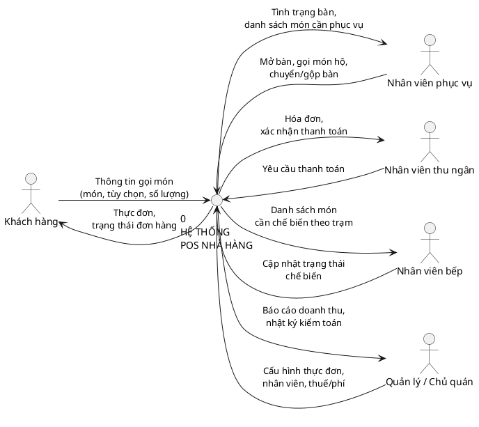

# NỘI DUNG THUYẾT TRÌNH — HỆ THỐNG POS NHÀ HÀNG

Viết theo từng slide, câu ngắn để dễ đọc khi trình chiếu. Bạn copy từng khối vào PowerPoint,
không cần dán nguyên đoạn văn dài như trong báo cáo.

---

## PHẦN A — MỞ ĐẦU

### Slide 1 — Trang bìa

- Tên đề tài: **Xây dựng hệ thống quản lý điểm bán hàng cho nhà hàng (Restaurant POS)**
- Họ tên sinh viên / MSSV / Lớp
- Giảng viên hướng dẫn

### Slide 2 — Lý do chọn đề tài

- Quán ăn vừa và nhỏ phần lớn vẫn ghi order giấy, tính tiền tay → sai sót, chậm, thất thoát doanh thu
- Giải pháp POS thương mại (Qashier, FoodStory, Wongnai...) chi phí thuê bao cao, khó tùy biến theo quy trình riêng của quán
- Cơ hội tự xây dựng một hệ thống nhiều màn hình cùng thao tác đồng thời trên một nguồn dữ liệu duy nhất

### Slide 3 — Mục tiêu

- Xây dựng 4 màn hình phối hợp thời gian thực: khách hàng — nhân viên phục vụ/thu ngân — bếp — hậu đài
- Tính tiền chính xác tuyệt đối (số nguyên, không dùng số thực)
- Thiết kế thực đơn 3 lớp linh hoạt: danh mục → món ăn → nhóm tùy chọn
- Phân quyền theo vai trò nhân viên, có nhật ký kiểm toán

### Slide 4 — Phương pháp nghiên cứu

- Khảo sát quy trình vận hành thực tế một nhà hàng phục vụ tại bàn
- Phân tích nghiệp vụ → thiết kế mô hình dữ liệu → xây dựng theo từng module
- Phát triển lặp (iterative): hoàn thiện và kiểm thử từng module trước khi sang module tiếp
- Kiểm thử tự động trên cơ sở dữ liệu thật (811 kịch bản) + kiểm thử giao diện qua trình duyệt thật

---

## PHẦN B — CÔNG NGHỆ SỬ DỤNG

### Slide 5 — Frontend

- **Next.js 16.2 (App Router)** + **React 19**
- **TypeScript** toàn bộ dự án
- **Tailwind CSS 4** — thiết kế riêng (design system nội bộ), không dùng thư viện UI dựng sẵn
- **Server-Sent Events (EventSource)** phía trình duyệt — nhận tín hiệu, tự làm mới dữ liệu theo thời gian thực
- Không dùng WebSocket: Route Handler của Next.js không nâng cấp được lên WebSocket, nền tảng serverless không giữ kết nối TCP mở lâu

### Slide 6 — Backend

- **Server Actions** của Next.js — giao diện gọi thẳng hàm phía máy chủ, không cần dựng REST API riêng
- **Prisma ORM 7** kết nối **PostgreSQL 17** qua driver adapter
- Xác thực nhân viên: mã PIN băm bằng **scrypt**, phiên đăng nhập bằng cookie ký **HMAC** + kiểm tra thu hồi trong DB
- Mọi thao tác đa bảng (chuyển/gộp bàn, thanh toán + phát hành hóa đơn) dùng **transaction** để đảm bảo toàn vẹn dữ liệu
- Đồng bộ thời gian thực đa instance qua **PostgreSQL LISTEN/NOTIFY**

---

## PHẦN C — PHÂN TÍCH THIẾT KẾ HỆ THỐNG

### Slide 7 — Biểu đồ chức năng nghiệp vụ

Dùng lại **Hình 1** trong `phan-2-chuong-2-mo-ta-bai-toan.md` (sơ đồ phân rã 9 nhóm chức năng: thực đơn, bàn & phiên gọi món, đơn hàng, bếp, thanh toán, hóa đơn, nhân viên, cấu hình, báo cáo).

→ Export ảnh từ khối `plantuml` đầu tiên trong file đó (dán vào plantuml.com/plantuml).

### Slide 8 — Biểu đồ use case hệ thống

Dùng lại **Hình 2** (UC00 — use case tổng quát) trong cùng file, mục 2.6: 5 tác nhân (Khách hàng, Nhân viên phục vụ, Nhân viên thu ngân, Nhân viên bếp, Quản lý/Chủ quán) kết nối tới 8 use case chính.

→ Nếu muốn thuyết trình sâu hơn, chèn thêm **Hình 4** (UC02 chi tiết, 8 use case con).

### Slide 9 — Biểu đồ dữ liệu mức bối cảnh (Context Diagram / DFD mức 0)

Sơ đồ này **chưa có sẵn trong báo cáo — tạo mới cho slide này**, thể hiện toàn hệ thống như một tiến trình duy nhất, cùng luồng dữ liệu ra/vào với 5 tác nhân bên ngoài:

Dán vào plantuml.com/plantuml để lấy ảnh PNG.

---

## PHẦN D — GIAO DIỆN VÀ CHỨC NĂNG

*(Mỗi slide nên kèm ảnh chụp màn hình thật từ hệ thống đang chạy — chèn ảnh trước, bullet bên dưới làm chú thích)*

### Slide 10 — Màn hình khách hàng (`/t/[tableCode]`)

- Xem thực đơn theo danh mục, chọn món kèm tùy chọn
- Giỏ hàng lưu phía máy chủ — không mất khi tải lại trang
- Theo dõi trạng thái đơn hàng theo thời gian thực
- *Lưu ý khi trình bày:* nêu rõ hiện dùng đường dẫn riêng của bàn, ảnh mã QR để quét chưa được sinh ra (hạng mục còn thiếu)

### Slide 11 — Màn hình nhân viên phục vụ/thu ngân (`/pos`)

- Sơ đồ bàn: trống / đang phục vụ / cần chú ý
- Một màn hình gồm cả thực đơn (gọi món thay khách) và giỏ hàng — không cần chuyển trang
- Tính tiền: phí dịch vụ → thuế, chống thanh toán trùng

### Slide 12 — Màn hình bếp (`/kds`)

- Danh sách món theo từng trạm chế biến, sắp theo thời gian gửi đơn
- Chuyển trạng thái một chiều: đã nhận → đang làm → đã xong
- Cập nhật tức thời trên mọi màn hình bếp đang mở

### Slide 13 — Màn hình hậu đài (`/admin`)

- Tổng quan doanh thu trong ngày, món bán chạy
- Quản lý thực đơn, nhân viên, bàn/điểm bán hàng, cấu hình thuế/phí
- Danh sách hóa đơn, nhật ký kiểm toán

---

## PHẦN E — KẾT LUẬN

### Slide 14 — Kết quả đạt được

- 4 màn hình hoàn chỉnh, phối hợp thời gian thực trên cùng dữ liệu
- Tính tiền chính xác tuyệt đối, có kiểm thử xác nhận bằng số liệu thực tế
- Phân quyền 5 vai trò + nhật ký kiểm toán đầy đủ
- 811 kịch bản kiểm thử tự động, chạy trên cơ sở dữ liệu thật

### Slide 15 — Hạn chế & hướng phát triển

- Chưa sinh ảnh mã QR thật; chưa có module tồn kho đầy đủ; thanh toán còn ở chế độ minh họa
- Hướng phát triển: tích hợp cổng thanh toán thật, báo cáo đóng ca, tồn kho, và tích hợp AI (gợi ý món, trợ lý báo cáo bằng ngôn ngữ tự nhiên, phát hiện bất thường trên nhật ký kiểm toán)

### Slide 16 — Cảm ơn / Hỏi đáp

- Lời cảm ơn giảng viên hướng dẫn
- Mời câu hỏi
