## CHƯƠNG 2: MÔ TẢ BÀI TOÁN VÀ ĐẶC TẢ YÊU CẦU PHẦN MỀM

### 2.1. Mô tả bài toán

Trong mô hình nhà hàng phục vụ tại bàn, việc ứng dụng phần mềm vào quản lý bán hàng đã trở thành một yêu cầu tất yếu để thay thế quy trình ghi order bằng giấy vốn tồn tại nhiều hạn chế. Đặc biệt, công tác vận hành tại nhà hàng ngày càng trở nên phức tạp khi cùng một đơn hàng phải đi qua nhiều bộ phận khác nhau — khách hàng gọi món, nhân viên xác nhận, bếp chế biến, nhân viên phục vụ — và mỗi bộ phận cần nắm bắt trạng thái mới nhất gần như tức thời.

Trong thực tế, việc quản lý điểm bán hàng tại nhà hàng bao gồm nhiều nghiệp vụ như quản lý thực đơn (món ăn, nhóm tùy chọn, tùy chọn), quản lý bàn và phiên gọi món, xử lý đơn hàng, tính tiền (phí dịch vụ, thuế), thanh toán, xuất hóa đơn và quản lý nhân viên theo từng vị trí công việc. Nếu các nghiệp vụ này được thực hiện bằng phương pháp thủ công hoặc các công cụ rời rạc không đồng bộ với nhau, sẽ dễ dẫn đến sai sót trong truyền đạt order, chậm trễ trong xử lý, và khó khăn trong việc kiểm soát doanh thu.

Ngoài ra, việc tổng hợp thông tin từ nhiều màn hình khác nhau (khách hàng, nhân viên, bếp, quản lý) cũng gặp nhiều khó khăn nếu không có một hệ thống dữ liệu tập trung, đồng bộ theo thời gian thực. Điều này ảnh hưởng đến hiệu quả vận hành cũng như khả năng ra quyết định của chủ quán.

Do đó, bài toán đặt ra là xây dựng hệ thống POS nhà hàng nhằm hỗ trợ tự động hóa các nghiệp vụ gọi món — chế biến — thanh toán, lưu trữ dữ liệu tập trung, đảm bảo tính chính xác tuyệt đối trong tính toán tiền tệ và cung cấp các chức năng tra cứu, báo cáo hiệu quả. Hệ thống cần đáp ứng nhu cầu của nhiều nhóm người dùng khác nhau (khách hàng, nhân viên phục vụ, thu ngân, bếp, quản lý) và có khả năng mở rộng trong tương lai.

### 2.2. Tổng quan yêu cầu phần mềm

#### 2.2.1. Các nhóm người dùng

Hệ thống phục vụ các nhóm người dùng sau, tương ứng với từng vai trò trong mô hình vận hành thực tế của nhà hàng:

- **Khách hàng**: quét mã QR gắn tại bàn để mở phiên gọi món, xem thực đơn, chọn món kèm tùy chọn, gửi đơn và theo dõi trạng thái đơn hàng của mình — không cần tài khoản đăng nhập.
- **Nhân viên phục vụ (Server)**: mở bàn, gọi món thay khách hàng, theo dõi các bàn đang phục vụ, đánh dấu món đã lên bàn.
- **Nhân viên thu ngân (Cashier)**: thực hiện các quyền của nhân viên phục vụ, đồng thời được phép tính tiền, thu tiền và đóng bàn.
- **Nhân viên bếp (Kitchen)**: chỉ truy cập màn hình bếp (KDS), nhận đơn theo từng trạm chế biến (bếp nóng, quầy nước, bếp bánh...) và cập nhật trạng thái món ăn.
- **Quản lý (Manager)**: có toàn bộ quyền vận hành hằng ngày — quản lý thực đơn, nhân viên, cấu hình hệ thống, xem báo cáo, đọc nhật ký kiểm toán — trừ nhóm cấu hình ảnh hưởng trực tiếp đến số tiền khách phải trả.
- **Chủ quán (Owner)**: có toàn bộ quyền của quản lý, và là người duy nhất được thay đổi các thông số ảnh hưởng trực tiếp đến số tiền khách phải trả (thuế VAT, phí dịch vụ, sách giá đã bao gồm VAT hay chưa, tỉ lệ giảm giá nhân viên, đơn vị tiền tệ của chi nhánh).

Việc phân quyền theo từng vai trò cụ thể (thay vì chỉ hai nhóm "quản trị viên" và "nhân viên") xuất phát từ đặc thù thực tế của nhà hàng: người cầm tiền (thu ngân) và người phục vụ khách cần được tách bạch, và một số thao tác nhạy cảm về tiền (hủy món đã gửi bếp, sửa thuế/phí) cần được giới hạn ở cấp cao hơn.

Hệ thống cung cấp các nhóm chức năng chính sau:

#### 2.2.2. Quản lý thực đơn

Thực đơn được tổ chức theo ba lớp: **danh mục món ăn** → **món ăn** → **nhóm tùy chọn** (kèm các **tùy chọn** cụ thể có thể cộng/trừ giá). Cấu trúc này cho phép mô tả các món có nhiều biến thể (kích cỡ, độ cay, độ ngọt, topping) mà không cần thiết kế cứng từng cột riêng cho từng loại tùy chọn.

Các thông tin được quản lý bao gồm:

- Thông tin cơ bản của món: tên, mô tả, giá gốc, hình ảnh, danh mục, trạm chế biến (bếp nào phụ trách), thứ tự hiển thị.
- Trạng thái còn bán/ngừng bán (không xóa món đã từng được đặt — chỉ đánh dấu ngừng bán, vì lịch sử đơn hàng cũ vẫn phải giữ nguyên tên/giá tại thời điểm bán).
- Nhóm tùy chọn: bắt buộc chọn hay không, số lượng tối thiểu/tối đa được chọn, và danh sách các tùy chọn con kèm mức cộng/trừ giá.
- Một nhóm tùy chọn (ví dụ "Độ cay") có thể được dùng chung cho nhiều món khác nhau, tránh tạo trùng lặp dữ liệu.

#### 2.2.3. Quản lý bàn và phiên gọi món

Mỗi bàn được gắn một mã định danh duy nhất, dẫn đến trang gọi món riêng của bàn đó qua một đường dẫn cố định. Khi khách hàng truy cập đường dẫn này, hệ thống mở (hoặc tham gia vào) một **phiên gọi món** đang diễn ra tại bàn — nhiều khách cùng bàn truy cập chung một đường dẫn sẽ được gộp vào cùng một phiên và cùng một hóa đơn.

Hệ thống hỗ trợ:

- Mở bàn thủ công bởi nhân viên (trường hợp khách không tự truy cập được đường dẫn của bàn).
- Chuyển bàn và gộp bàn — toàn bộ đơn hàng chưa thanh toán của bàn được chuyển/gộp trong cùng một thao tác, không tách rời từng phần.
- Phát hành lại mã định danh mới cho một bàn khi cần (mã cũ ngay lập tức không còn hiệu lực với ai truy cập sau đó, nhưng không ảnh hưởng đến phiên đang phục vụ).
- Ngoài bàn ngồi tại chỗ, hệ thống còn hỗ trợ **quầy bán mang về**, hoạt động theo số thứ tự thay vì theo tên bàn, không tính phí dịch vụ và luôn mở phiên mới cho mỗi lượt khách thay vì gộp chung.

> **⚠ Chưa hoàn thiện:** mã định danh nói trên được thiết kế để dùng làm mã QR (khách quét bằng camera điện thoại để vào thẳng trang gọi món), nhưng hệ thống **hiện chưa sinh ra ảnh mã QR thật** — trang cấu hình bàn ở hậu đài chỉ hiển thị mã này dưới dạng chữ. Trong phạm vi hiện tại, khách hàng cần được cung cấp đường dẫn trực tiếp (ví dụ dán ở bàn dưới dạng chữ, hoặc nhân viên hỗ trợ) thay vì quét mã QR thật.

#### 2.2.4. Quản lý đơn hàng và bếp (Kitchen Display System)

Sau khi khách hàng hoặc nhân viên gửi đơn, các món ăn được chuyển đến đúng trạm chế biến tương ứng trên màn hình bếp theo thời gian thực (không cần bếp bấm làm mới trang). Mỗi món ăn trong đơn có một trạng thái chế biến độc lập (đã nhận — đang làm — đã xong), và trạng thái tổng thể của cả hóa đơn được suy ra từ trạng thái của món chậm nhất.

Bếp chỉ được phép chuyển trạng thái món theo một chiều (đã nhận → đang làm → đã xong), không có thao tác lùi trạng thái. Việc đánh dấu món "đã phục vụ lên bàn" thuộc quyền của nhân viên phục vụ, không phải của bếp.

#### 2.2.5. Tính tiền và thanh toán

Toàn bộ phép tính tiền (giá món, phí dịch vụ, thuế giá trị gia tăng, giảm giá) được thực hiện bằng số nguyên (đơn vị nhỏ nhất của tiền tệ), tuân thủ thứ tự tính phí dịch vụ trước rồi mới tính thuế trên tổng đã gồm phí dịch vụ, để loại bỏ hoàn toàn sai số làm tròn số thực.

Hệ thống hỗ trợ thanh toán bằng tiền mặt hoặc mã QR (ở chế độ minh họa quy trình, chưa kết nối cổng thanh toán ngân hàng thật), và có cơ chế chống thao tác gửi thanh toán trùng lặp khi nhân viên bấm nút nhiều lần liên tiếp. Một hóa đơn chỉ được đóng khi toàn bộ đơn hàng trong phiên đã có trạng thái phù hợp; hệ thống luôn tính lại số tiền cần thu ngay tại thời điểm xác nhận, không tin vào số tiền được gửi sẵn từ giao diện, nhằm tránh trường hợp hóa đơn thay đổi giữa lúc nhân viên xem và lúc bấm xác nhận.

#### 2.2.6. Quản lý hóa đơn

Sau khi thanh toán, hệ thống phát hành hóa đơn (biên nhận) với số thứ tự liên tục, không bị gián đoạn theo từng chi nhánh, cùng thông tin người bán được lưu cố định tại thời điểm xuất hóa đơn (tên quán, mã số thuế, địa chỉ) để đảm bảo hóa đơn cũ không bị thay đổi nội dung nếu sau này quán cập nhật thông tin hoặc đổi mức thuế.

Nhân viên thu ngân trở lên có thể in lại hóa đơn khi khách yêu cầu; việc tra cứu danh sách hóa đơn theo thời gian được giới hạn cho quản lý và chủ quán.

#### 2.2.7. Quản lý nhân viên và phân quyền

Nhân viên đăng nhập bằng mã số cá nhân và mã PIN ngắn thay vì tài khoản/mật khẩu truyền thống, phù hợp với thao tác nhanh tại quầy. Hệ thống giới hạn số lần nhập sai PIN liên tiếp và tạm khóa đăng nhập khi vượt ngưỡng.

Quản lý/chủ quán có thể tạo, chỉnh sửa thông tin, đặt lại mã PIN và vô hiệu hóa tài khoản nhân viên; việc đặt lại PIN hoặc vô hiệu hóa tài khoản sẽ ngay lập tức đăng xuất nhân viên đó khỏi mọi thiết bị đang đăng nhập. Một nhân viên không thể tự thay đổi vai trò hoặc vô hiệu hóa chính tài khoản mình từ màn hình quản lý nhân viên.

#### 2.2.8. Cấu hình hệ thống

Chủ quán và quản lý có thể cấu hình thông tin quán (tên, địa chỉ, số điện thoại, nội dung in cuối hóa đơn), danh sách trạm chế biến trong bếp, và danh sách bàn/điểm bán hàng (thêm bàn mới, đổi tên, phát hành lại mã QR, ngừng hoạt động). Riêng nhóm thông số ảnh hưởng trực tiếp đến số tiền khách phải trả (thuế VAT, phí dịch vụ, giá đã bao gồm VAT hay chưa, tỉ lệ giảm giá nhân viên, đơn vị tiền tệ) chỉ chủ quán mới được chỉnh sửa. Mọi thay đổi cấu hình đều được ghi lại giá trị trước và sau khi thay đổi vào nhật ký kiểm toán.

#### 2.2.9. Báo cáo doanh thu và nhật ký kiểm toán

Quản lý và chủ quán xem được tổng doanh thu trong ngày (tính theo số tiền thực nhận từ khách, không phải theo giá trị đơn hàng), danh sách món ăn bán chạy (tính theo số món đã gửi vào bếp, không chỉ tính các hóa đơn đã thanh toán), cùng nhật ký kiểm toán ghi lại các thao tác nhạy cảm liên quan đến tiền bạc (huỷ món đã gửi bếp, thay đổi cấu hình thuế/phí, thanh toán, phát hành lại mã QR...) kèm người thực hiện và thời điểm, phục vụ việc truy vết khi cần.

### 2.3. Mục đích

Mục đích của bài toán là tiến hành khảo sát, phân tích và xây dựng hệ thống POS nhà hàng nhằm phục vụ hiệu quả cho công tác vận hành từ khâu gọi món đến thanh toán tại một nhà hàng phục vụ tại bàn. Thông qua quá trình này, hệ thống sẽ hỗ trợ khách hàng tự gọi món qua mã QR, hỗ trợ nhân viên phục vụ/thu ngân trong việc mở bàn và tính tiền, hỗ trợ bếp trong việc theo dõi và xử lý đơn hàng theo thời gian thực, đồng thời hỗ trợ quản lý/chủ quán trong việc quản lý thực đơn, nhân viên và theo dõi doanh thu. Việc xây dựng hệ thống không chỉ giúp đơn giản hóa quá trình xử lý thông tin mà còn góp phần giảm sai sót, tiết kiệm thời gian và đảm bảo tính chính xác tuyệt đối trong tính toán tiền tệ.

### 2.4. Xác định yêu cầu phần mềm

Để xây dựng được hệ thống đáp ứng nhu cầu thực tế, trước hết cần tìm hiểu rõ và nắm vững quy trình vận hành thực tế của một nhà hàng phục vụ tại bàn — từ lúc khách vào bàn, gọi món, bếp chế biến, cho đến lúc thanh toán và rời đi. Trên cơ sở đó, tiến hành phân tích hệ thống theo từng chức năng cụ thể nhằm đảm bảo phù hợp với yêu cầu vận hành đã đặt ra. Sau bước phân tích, hệ thống được thiết kế thành một ứng dụng web hoàn chỉnh với bốn màn hình phối hợp thời gian thực, đáp ứng yêu cầu sử dụng và hỗ trợ hiệu quả cho khách hàng, nhân viên và quản lý trong quá trình vận hành.

### 2.5. Các chức năng quản lý

**Hình 1. Sơ đồ phân rã chức năng nghiệp vụ**

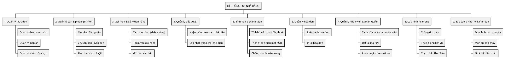

Sơ đồ trên phân rã hệ thống thành 9 nhóm chức năng chính, tương ứng trực tiếp với các nghiệp vụ đã mô tả tại mục 2.2 (từ 2.2.2 đến 2.2.9). Mỗi nhóm chức năng cấp 1 được chi tiết hóa thành các chức năng cấp 2 cụ thể, làm cơ sở cho phần đặc tả từng chức năng theo mô hình tác nhân — luồng sự kiện chính — luồng sự kiện phụ trình bày từ mục 2.5.1 đến 2.5.8.

#### 2.5.1. Chức năng quản lý thực đơn

**a) Tác nhân:**

- Quản lý/Chủ quán: người trực tiếp thao tác quản lý món ăn, danh mục và nhóm tùy chọn trên hệ thống.
- Khách hàng/Nhân viên: người xem thực đơn để chọn món khi gọi món (không thao tác chỉnh sửa).

**b) Luồng sự kiện chính:**

1. Bắt đầu: Quản lý đăng nhập vào hệ thống hậu đài.
2. Chọn chức năng: Quản lý chọn mục "Thực đơn".
3. Thêm món mới:
   - Hệ thống hiển thị biểu mẫu thêm món ăn.
   - Quản lý nhập thông tin: tên, mô tả, giá, danh mục, trạm chế biến, hình ảnh, chọn các nhóm tùy chọn áp dụng cho món.
   - Quản lý xác nhận lưu.
   - Hệ thống lưu vào cơ sở dữ liệu và hiển thị thông báo thành công.
4. Cập nhật món:
   - Quản lý tìm và chọn món cần cập nhật.
   - Hệ thống hiển thị thông tin hiện tại của món.
   - Quản lý chỉnh sửa và xác nhận lưu.
   - Hệ thống ghi lại giá trị trước và sau khi thay đổi vào nhật ký kiểm toán.
5. Ngừng bán / xóa món:
   - Nếu món chưa từng được đặt: hệ thống cho phép xóa hẳn khỏi thực đơn.
   - Nếu món đã từng được đặt: hệ thống chỉ cho phép đánh dấu ngừng bán, không cho xóa, để giữ nguyên dữ liệu lịch sử đơn hàng cũ.
6. Kết thúc: Quản lý thực hiện thao tác khác hoặc đăng xuất.

**c) Luồng sự kiện phụ:**

- Lỗi nhập liệu: hệ thống hiển thị thông báo lỗi và yêu cầu nhập lại nếu thiếu thông tin bắt buộc.
- Nhóm tùy chọn có số lượng chọn tối thiểu lớn hơn số tùy chọn hiện có: hệ thống từ chối lưu, vì khách hàng sẽ không bao giờ đặt món được.

#### 2.5.2. Chức năng gọi món (khách hàng)

**a) Tác nhân:**

- Khách hàng: người truy cập đường dẫn gọi món của bàn, xem thực đơn và gửi đơn gọi món.

**b) Luồng sự kiện chính:**

1. Bắt đầu: Khách hàng truy cập đường dẫn gọi món riêng của bàn (dự kiến qua quét mã QR — xem ghi chú ở cuối mục này).
2. Hệ thống mở (hoặc tham gia) phiên gọi món của bàn đó.
3. Xem thực đơn: hệ thống hiển thị danh mục và món ăn còn bán.
4. Chọn món:
   - Khách hàng chọn món, chọn các tùy chọn kèm theo (nếu có), chọn số lượng.
   - Hệ thống thêm vào giỏ hàng và tính lại tổng tiền tạm tính.
5. Gửi đơn:
   - Khách hàng xác nhận gửi đơn.
   - Hệ thống vô hiệu hóa nút gửi ngay khi vừa bấm để tránh gửi trùng, đồng thời kiểm tra lại trạng thái đơn ở phía máy chủ trước khi ghi nhận.
   - Đơn được chuyển đến đúng trạm chế biến tương ứng trên màn hình bếp.
6. Theo dõi trạng thái: khách hàng xem được trạng thái các món đã gọi theo thời gian thực.
7. Kết thúc: khách hàng có thể tiếp tục gọi thêm món hoặc chờ nhân viên tính tiền.

**c) Luồng sự kiện phụ:**

- Mã bàn hết hạn hoặc không hợp lệ: hệ thống từ chối và đưa khách về trang mở bàn.
- Gửi đơn trùng do bấm nhiều lần: hệ thống nhận diện đơn đã được gửi và trả về kết quả thành công của lần gửi trước, không tạo đơn thứ hai.

> **⚠ Chưa hoàn thiện:** toàn bộ luồng trên đã hoạt động đúng khi khách hàng có sẵn đường dẫn của bàn, nhưng hệ thống hiện **chưa sinh được ảnh mã QR thật** để bước 1 ("quét mã QR") diễn ra đúng như thiết kế ban đầu.

#### 2.5.3. Chức năng quản lý đơn hàng tại bếp (KDS)

**a) Tác nhân:**

- Nhân viên bếp: người xem và cập nhật trạng thái chế biến món ăn.

**b) Luồng sự kiện chính:**

1. Bắt đầu: Nhân viên bếp đăng nhập vào màn hình bếp, chọn trạm chế biến phụ trách (hoặc xem tất cả).
2. Hệ thống hiển thị danh sách các món đang chờ/đang làm của trạm đó, sắp xếp theo thời gian gửi đơn (món gửi trước hiển thị trước).
3. Nhận món: bếp bấm nhận món, hệ thống chuyển trạng thái từ "đã nhận" sang "đang làm".
4. Hoàn tất món: bếp bấm hoàn tất, hệ thống chuyển trạng thái sang "đã xong".
5. Món tự động biến mất khỏi màn hình bếp sau khi được nhân viên phục vụ đánh dấu đã lên bàn.
6. Kết thúc: bếp tiếp tục xử lý các món tiếp theo trong hàng đợi.

**c) Luồng sự kiện phụ:**

- Món không cần qua bếp (ví dụ nước đóng chai): không xuất hiện trên màn hình bếp, được đánh dấu sẵn sàng ngay khi khách gửi đơn.
- Hai màn hình bếp cùng thao tác một món gần như đồng thời: hệ thống chỉ chấp nhận thao tác chuyển trạng thái hợp lệ đầu tiên, thao tác sau bị từ chối một cách an toàn.

#### 2.5.4. Chức năng tính tiền và thanh toán

**a) Tác nhân:**

- Nhân viên thu ngân/Quản lý/Chủ quán: người thực hiện tính tiền và thu tiền từ khách.

**b) Luồng sự kiện chính:**

1. Bắt đầu: Nhân viên đăng nhập vào hệ thống, chọn bàn cần tính tiền.
2. Hệ thống tổng hợp toàn bộ đơn hàng chưa thanh toán trong phiên của bàn đó, tính tổng tiền món, phí dịch vụ, thuế và hiển thị số tiền cần thu.
3. Chọn phương thức thanh toán: nhân viên chọn tiền mặt hoặc mã QR.
4. Xác nhận thanh toán:
   - Nhân viên xác nhận.
   - Hệ thống tính lại toàn bộ số tiền tại thời điểm xác nhận (không dùng số liệu cũ từ màn hình), kiểm tra khớp với số tiền hiển thị trước đó.
   - Hệ thống ghi nhận khoản thanh toán, đóng phiên bàn, phát hành hóa đơn.
5. Kết thúc: hệ thống hiển thị màn hình xác nhận đã thanh toán, bàn trở về trạng thái trống.

**c) Luồng sự kiện phụ:**

- Bấm xác nhận thanh toán nhiều lần liên tiếp: hệ thống nhận diện bàn đã được đóng và trả lại kết quả của lần thanh toán đầu tiên, không thu tiền hai lần.
- Còn món chưa gửi bếp (còn nằm trong giỏ hàng): hệ thống từ chối thanh toán vì số tiền chưa phản ánh đầy đủ đơn hàng.

#### 2.5.5. Chức năng quản lý bàn và điểm bán hàng

**a) Tác nhân:**

- Quản lý/Chủ quán: người tạo, chỉnh sửa và ngừng hoạt động bàn/điểm bán hàng.
- Nhân viên phục vụ/thu ngân: người thực hiện chuyển bàn, gộp bàn trong quá trình phục vụ.

**b) Luồng sự kiện chính:**

1. Bắt đầu: Quản lý đăng nhập, chọn mục "Bàn & điểm bán hàng".
2. Thêm bàn mới: quản lý nhập tên bàn, số chỗ ngồi, loại điểm bán (bàn ngồi tại chỗ/quầy mang về); hệ thống tự sinh mã QR ngẫu nhiên duy nhất cho bàn.
3. Phát hành lại mã QR: quản lý xác nhận; hệ thống sinh mã mới, vô hiệu hóa mã cũ, ghi lại mã cũ vào nhật ký kiểm toán để truy vết khi cần.
4. Chuyển/gộp bàn (thực hiện bởi nhân viên): nhân viên chọn bàn nguồn và bàn đích; hệ thống chuyển toàn bộ đơn hàng chưa thanh toán trong một thao tác duy nhất.
5. Ngừng hoạt động bàn: hệ thống từ chối nếu bàn đang có hóa đơn chưa thanh toán.
6. Kết thúc: quản lý thực hiện thao tác khác hoặc đăng xuất.

**c) Luồng sự kiện phụ:**

- Đổi loại điểm bán (bàn ngồi ↔ quầy mang về) của một điểm bán đã có lịch sử giao dịch: hệ thống từ chối, vì loại điểm bán quyết định việc có tính phí dịch vụ hay không.

#### 2.5.6. Chức năng quản lý nhân viên và phân quyền

**a) Tác nhân:**

- Chủ quán/Quản lý: người tạo, chỉnh sửa, đặt lại PIN và vô hiệu hóa tài khoản nhân viên.

**b) Luồng sự kiện chính:**

1. Bắt đầu: Quản lý đăng nhập, chọn mục "Nhân viên".
2. Thêm nhân viên mới: nhập mã số, họ tên, vai trò (Server/Cashier/Kitchen/Manager); hệ thống tạo mã PIN và tài khoản.
3. Cập nhật thông tin/vai trò: quản lý chỉ được gán vai trò thấp hơn hoặc bằng cấp của chính mình.
4. Đặt lại mã PIN: hệ thống tạo PIN mới, đồng thời đăng xuất tài khoản đó khỏi toàn bộ thiết bị đang đăng nhập.
5. Vô hiệu hóa tài khoản: hệ thống chặn đăng nhập và đăng xuất khỏi mọi thiết bị ngay lập tức.
6. Kết thúc: quản lý thực hiện thao tác khác hoặc đăng xuất.

**c) Luồng sự kiện phụ:**

- Quản lý cố gắng tự sửa hoặc tự vô hiệu hóa chính tài khoản mình từ màn hình này: hệ thống từ chối, yêu cầu một tài khoản khác thực hiện.
- Nhập sai PIN quá số lần cho phép: hệ thống tạm khóa đăng nhập của mã nhân viên đó trong một khoảng thời gian nhất định.

#### 2.5.7. Chức năng quản lý hóa đơn

**a) Tác nhân:**

- Nhân viên thu ngân trở lên: in lại hóa đơn khi khách yêu cầu.
- Quản lý/Chủ quán: tra cứu danh sách hóa đơn đã phát hành.

**b) Luồng sự kiện chính:**

1. Bắt đầu: Nhân viên đăng nhập, chọn mục "Hóa đơn".
2. Tìm kiếm hóa đơn: theo số hóa đơn, số bàn hoặc khoảng thời gian.
3. Xem chi tiết hóa đơn: hệ thống hiển thị đầy đủ thông tin món, số tiền, thông tin quán tại thời điểm phát hành.
4. In lại: nhân viên xác nhận in; hệ thống đánh dấu đây là bản in thứ hai trở đi (hiển thị rõ trên bản in) và ghi lại vào nhật ký kiểm toán.
5. Kết thúc: nhân viên thực hiện thao tác khác hoặc đăng xuất.

**c) Luồng sự kiện phụ:**

- Không tìm thấy hóa đơn phù hợp: hệ thống hiển thị thông báo không có kết quả.

#### 2.5.8. Chức năng báo cáo doanh thu

**a) Tác nhân:**

- Quản lý/Chủ quán: người xem báo cáo doanh thu trong ngày.

**b) Luồng sự kiện chính:**

1. Bắt đầu: Quản lý đăng nhập, hệ thống hiển thị trang tổng quan doanh thu.
2. Xem doanh thu trong ngày: hệ thống hiển thị tổng số tiền đã thu thực tế (theo số tiền khách đã trả, không tính theo giá trị đơn hàng).
3. Xem món ăn bán chạy: hệ thống hiển thị danh sách món được gửi vào bếp nhiều nhất trong ngày.
4. Xem tình trạng hoạt động hiện tại: số bàn đang phục vụ, số đơn đang chờ bếp xử lý.
5. Kết thúc: quản lý xem thêm nhật ký kiểm toán hoặc đăng xuất.

**c) Luồng sự kiện phụ:**

- Chưa có giao dịch nào trong ngày: hệ thống hiển thị báo cáo với các giá trị bằng 0, không báo lỗi.

### 2.6. Use case tổng quát

Từ các yêu cầu về chức năng của hệ thống, có thể mô hình hóa các chức năng của hệ thống bởi biểu đồ use case tổng quát sau:

| | |
|---|---|
| **Mã Use Case** | UC00 |
| **Tên Use Case** | Tổng quan chức năng hệ thống POS nhà hàng |
| **Tác nhân** | Khách hàng, Nhân viên phục vụ, Nhân viên thu ngân, Nhân viên bếp, Quản lý, Chủ quán |
| **Mô tả** | Use case mô tả các chức năng chính của toàn hệ thống POS nhà hàng, bao gồm gọi món, quản lý bàn, xử lý đơn hàng tại bếp, tính tiền và thanh toán, quản lý hóa đơn, quản lý thực đơn, quản lý nhân viên và báo cáo doanh thu. |
| **Điều kiện trước** | Khách hàng đã quét mã QR để mở phiên gọi món, hoặc nhân viên đã đăng nhập bằng mã số và mã PIN |
| **Điều kiện sau** | Người dùng thực hiện thành công các chức năng tương ứng theo đúng quyền được cấp |

**Hình 2. Biểu đồ use case tổng quát**

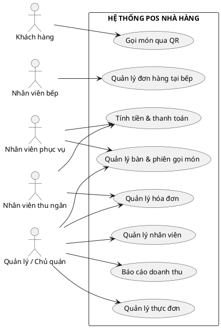

### 2.7. Use case quản lý nhân viên và phân quyền

| | |
|---|---|
| **Mã Use Case** | UC01 |
| **Tên Use Case** | Quản lý nhân viên và phân quyền |
| **Tác nhân** | Quản lý, Chủ quán |
| **Mô tả** | Thêm, chỉnh sửa thông tin, đặt lại mã PIN, vô hiệu hóa tài khoản nhân viên; gán vai trò theo vị trí công việc (phục vụ/thu ngân/bếp/quản lý). |
| **Điều kiện trước** | Đăng nhập với quyền quản lý/chủ quán |
| **Điều kiện sau** | Tài khoản nhân viên được thêm/cập nhật/vô hiệu hóa và có hiệu lực ngay trên mọi thiết bị đang đăng nhập |

**Hình 3. Biểu đồ use case quản lý nhân viên và phân quyền**

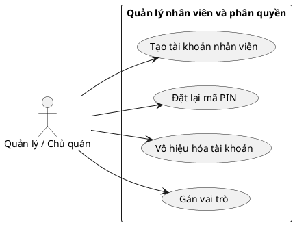

### 2.8. Use case chi tiết hệ thống

| | |
|---|---|
| **Mã Use Case** | UC02 |
| **Tên Use Case** | Vận hành và quản lý hậu đài |
| **Tác nhân** | Nhân viên phục vụ, Nhân viên thu ngân, Nhân viên bếp, Quản lý, Chủ quán |
| **Mô tả** | Quản lý toàn bộ nghiệp vụ vận hành nhà hàng: thực đơn, bàn, đơn hàng, bếp, thanh toán, hóa đơn, cấu hình hệ thống và báo cáo. |
| **Điều kiện trước** | Đăng nhập với quyền tương ứng từng chức năng |
| **Điều kiện sau** | Thông tin thực đơn, bàn, đơn hàng và hóa đơn được cập nhật chính xác |

**Hình 4. Biểu đồ use case chi tiết hệ thống**

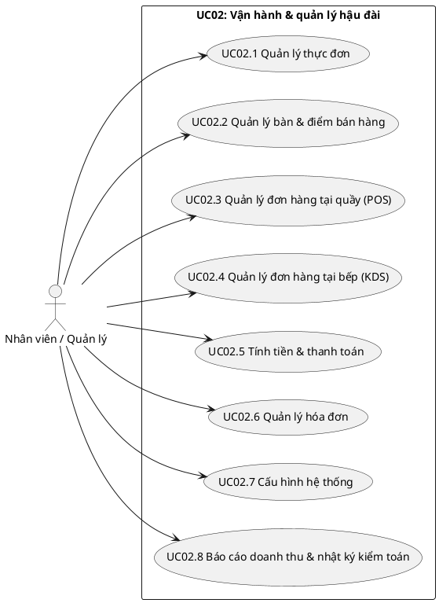

#### 2.8.1. Use case quản lý thực đơn

| | |
|---|---|
| **Mã Use Case** | UC02.1 |
| **Tên Use Case** | Quản lý thực đơn |
| **Tác nhân** | Quản lý, Chủ quán |
| **Mô tả** | Thêm, sửa thông tin món ăn/danh mục/nhóm tùy chọn, ngừng bán hoặc xóa món, tìm kiếm theo tên hoặc danh mục. |
| **Điều kiện trước** | Đăng nhập với quyền quản lý/chủ quán |
| **Điều kiện sau** | Thực đơn được cập nhật, khách hàng và nhân viên tra cứu được ngay trên màn hình gọi món |

**Hình 5. Biểu đồ use case quản lý thực đơn**

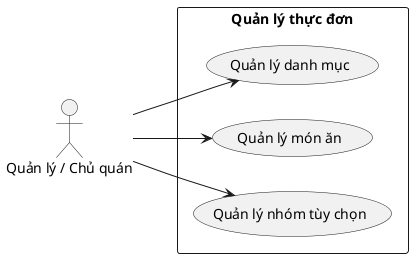

#### 2.8.2. Use case quản lý đơn hàng tại quầy (POS)

| | |
|---|---|
| **Mã Use Case** | UC02.2 |
| **Tên Use Case** | Quản lý đơn hàng tại quầy |
| **Tác nhân** | Nhân viên phục vụ, Nhân viên thu ngân |
| **Mô tả** | Mở bàn, gọi món thay khách hàng, chuyển/gộp bàn, đánh dấu món đã phục vụ lên bàn. |
| **Điều kiện trước** | Đăng nhập vào màn hình POS |
| **Điều kiện sau** | Đơn hàng được tạo/chuyển thành công, dữ liệu đồng bộ tới màn hình bếp và khách hàng |

**Hình 6. Biểu đồ use case quản lý đơn hàng tại quầy**

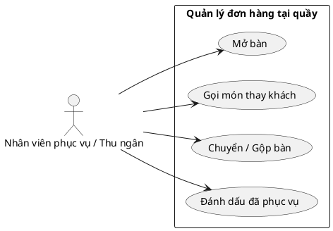

#### 2.8.3. Use case quản lý đơn hàng tại bếp (KDS)

| | |
|---|---|
| **Mã Use Case** | UC02.3 |
| **Tên Use Case** | Quản lý đơn hàng tại bếp |
| **Tác nhân** | Nhân viên bếp |
| **Mô tả** | Xem danh sách món cần chế biến theo từng trạm, cập nhật trạng thái món theo thời gian thực. |
| **Điều kiện trước** | Đăng nhập vào màn hình bếp, chọn trạm chế biến |
| **Điều kiện sau** | Trạng thái món được cập nhật, các màn hình liên quan (khách hàng, phục vụ) thấy thay đổi ngay lập tức |

**Hình 7. Biểu đồ use case quản lý đơn hàng tại bếp**

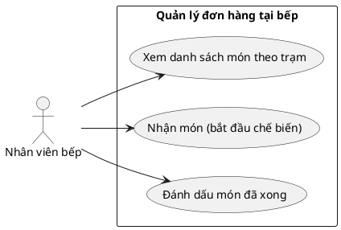

#### 2.8.4. Use case tính tiền và thanh toán

| | |
|---|---|
| **Mã Use Case** | UC02.4 |
| **Tên Use Case** | Tính tiền và thanh toán |
| **Tác nhân** | Nhân viên thu ngân, Quản lý, Chủ quán |
| **Mô tả** | Tổng hợp hóa đơn của bàn (phí dịch vụ, thuế), chọn phương thức thanh toán, xác nhận thu tiền, đóng phiên bàn. |
| **Điều kiện trước** | Đăng nhập, bàn có ít nhất một đơn hàng đã gửi bếp |
| **Điều kiện sau** | Hóa đơn được thanh toán, phiên bàn đóng lại, chứng từ được phát hành |

**Hình 8. Biểu đồ use case tính tiền và thanh toán**

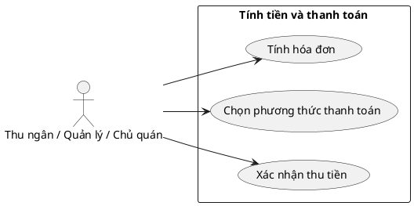

#### 2.8.5. Use case quản lý hóa đơn

| | |
|---|---|
| **Mã Use Case** | UC02.5 |
| **Tên Use Case** | Quản lý hóa đơn |
| **Tác nhân** | Nhân viên thu ngân trở lên, Quản lý, Chủ quán |
| **Mô tả** | Tra cứu hóa đơn đã phát hành, xem chi tiết, in lại khi khách yêu cầu. |
| **Điều kiện trước** | Đăng nhập |
| **Điều kiện sau** | Hóa đơn được tra cứu/in lại chính xác, có ghi nhật ký khi in lại |

**Hình 9. Biểu đồ use case quản lý hóa đơn**

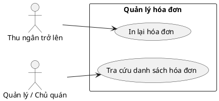

#### 2.8.6. Use case cấu hình hệ thống

| | |
|---|---|
| **Mã Use Case** | UC02.6 |
| **Tên Use Case** | Cấu hình hệ thống |
| **Tác nhân** | Quản lý, Chủ quán |
| **Mô tả** | Cấu hình thông tin quán, trạm chế biến, bàn/điểm bán hàng; riêng thuế/phí dịch vụ/đơn vị tiền tệ chỉ chủ quán được sửa. |
| **Điều kiện trước** | Đăng nhập với quyền quản lý/chủ quán |
| **Điều kiện sau** | Cấu hình được cập nhật, áp dụng cho các hóa đơn tiếp theo, không ảnh hưởng hóa đơn đã đóng |

**Hình 10. Biểu đồ use case cấu hình hệ thống**

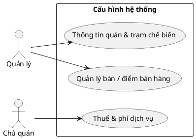

#### 2.8.7. Use case quản lý bàn và điểm bán hàng

| | |
|---|---|
| **Mã Use Case** | UC02.7 |
| **Tên Use Case** | Quản lý bàn và điểm bán hàng |
| **Tác nhân** | Quản lý, Chủ quán (tạo/sửa/ngừng hoạt động), Nhân viên phục vụ (chuyển/gộp bàn) |
| **Mô tả** | Thêm bàn mới, phát hành lại mã QR, ngừng hoạt động điểm bán, chuyển/gộp bàn trong quá trình phục vụ. |
| **Điều kiện trước** | Đăng nhập |
| **Điều kiện sau** | Danh sách bàn/điểm bán được cập nhật; bàn có hóa đơn đang mở không thể bị ngừng hoạt động |

**Hình 11. Biểu đồ use case quản lý bàn và điểm bán hàng**

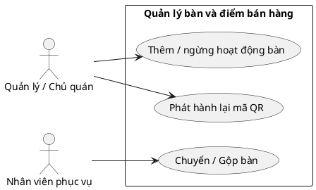

#### 2.8.8. Use case báo cáo doanh thu và nhật ký kiểm toán

| | |
|---|---|
| **Mã Use Case** | UC02.8 |
| **Tên Use Case** | Báo cáo doanh thu và nhật ký kiểm toán |
| **Tác nhân** | Quản lý, Chủ quán |
| **Mô tả** | Xem doanh thu trong ngày, món ăn bán chạy, tra cứu nhật ký các thao tác nhạy cảm liên quan đến tiền bạc. |
| **Điều kiện trước** | Đăng nhập với quyền quản lý/chủ quán |
| **Điều kiện sau** | Hệ thống hiển thị báo cáo và nhật ký chính xác theo đúng dữ liệu thực thu |

**Hình 12. Biểu đồ use case báo cáo doanh thu và nhật ký kiểm toán**

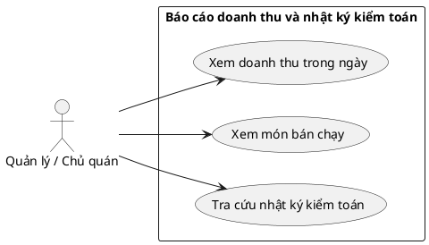

### 2.9. Mô hình quan hệ thực thể

**Hình 13. Biểu đồ quan hệ thực thể**

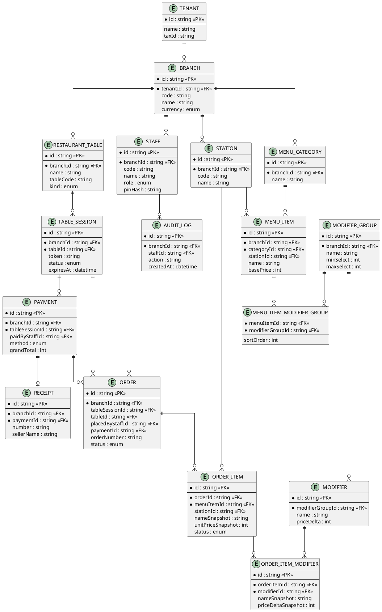

#### 2.9.1. Mối quan hệ TENANT – BRANCH

Kiểu quan hệ: Một-nhiều (1:N)
Ý nghĩa: Một chủ sở hữu hệ thống (tenant) có thể quản lý nhiều chi nhánh, mỗi chi nhánh thuộc về một tenant duy nhất.
Thể hiện: Khóa ngoại `tenantId` (FK) trong bảng `BRANCH` tham chiếu đến khóa chính `id` trong bảng `TENANT`.

#### 2.9.2. Mối quan hệ MENU_CATEGORY – MENU_ITEM

Kiểu quan hệ: Một-nhiều (1:N)
Ý nghĩa: Một danh mục có nhiều món ăn, mỗi món ăn chỉ thuộc về một danh mục duy nhất.
Thể hiện: Khóa ngoại `categoryId` (FK) trong bảng `MENU_ITEM` tham chiếu đến khóa chính `id` trong bảng `MENU_CATEGORY`.

#### 2.9.3. Mối quan hệ MENU_ITEM – MODIFIER_GROUP

Kiểu quan hệ: Nhiều-nhiều (N:N)
Ý nghĩa: Một món ăn có thể áp dụng nhiều nhóm tùy chọn (kích cỡ, độ cay...), và một nhóm tùy chọn có thể dùng chung cho nhiều món ăn khác nhau.
Thể hiện: Bảng trung gian `MENU_ITEM_MODIFIER_GROUP` chứa hai khóa ngoại `menuItemId` và `modifierGroupId` tham chiếu đến `MENU_ITEM` và `MODIFIER_GROUP`.

#### 2.9.4. Mối quan hệ RESTAURANT_TABLE – TABLE_SESSION

Kiểu quan hệ: Một-nhiều (1:N)
Ý nghĩa: Một bàn/điểm bán hàng có thể có nhiều phiên gọi món theo thời gian (mỗi lượt khách là một phiên), nhưng một bàn ngồi tại chỗ chỉ có tối đa một phiên đang mở tại một thời điểm.
Thể hiện: Khóa ngoại `tableId` (FK) trong bảng `TABLE_SESSION` tham chiếu đến khóa chính `id` trong bảng `RESTAURANT_TABLE`.

#### 2.9.5. Mối quan hệ TABLE_SESSION – ORDER

Kiểu quan hệ: Một-nhiều (1:N)
Ý nghĩa: Một phiên gọi món có thể có nhiều đơn hàng (mỗi lần khách gửi order là một đơn), tổng hợp lại thành một hóa đơn duy nhất khi thanh toán.
Thể hiện: Khóa ngoại `tableSessionId` (FK) trong bảng `ORDER` tham chiếu đến khóa chính `id` trong bảng `TABLE_SESSION`.

#### 2.9.6. Mối quan hệ ORDER – ORDER_ITEM

Kiểu quan hệ: Một-nhiều (1:N)
Ý nghĩa: Một đơn hàng gồm nhiều dòng món, mỗi dòng lưu lại tên và đơn giá tại thời điểm đặt (snapshot) để không bị thay đổi nếu thực đơn cập nhật giá sau này.
Thể hiện: Khóa ngoại `orderId` (FK) trong bảng `ORDER_ITEM` tham chiếu đến khóa chính `id` trong bảng `ORDER`.

#### 2.9.7. Mối quan hệ ORDER_ITEM – MODIFIER (qua ORDER_ITEM_MODIFIER)

Kiểu quan hệ: Một-nhiều (1:N)
Ý nghĩa: Một dòng món có thể đi kèm nhiều tùy chọn đã chọn (ví dụ vừa chọn "size lớn" vừa chọn "thêm trứng"), mỗi tùy chọn cũng được lưu snapshot tên và mức cộng/trừ giá tại thời điểm đặt.
Thể hiện: Khóa ngoại `orderItemId` và `modifierId` (FK) trong bảng `ORDER_ITEM_MODIFIER` tham chiếu lần lượt đến `ORDER_ITEM` và `MODIFIER`.

#### 2.9.8. Mối quan hệ TABLE_SESSION – PAYMENT – RECEIPT

Kiểu quan hệ: Một-nhiều (1:N) giữa `TABLE_SESSION` và `PAYMENT`; Một-một (1:1) giữa `PAYMENT` và `RECEIPT`.
Ý nghĩa: Một phiên gọi món được thanh toán tạo ra một khoản thu (Payment); khoản thu đó phát hành đúng một hóa đơn (Receipt) mang số thứ tự liên tục theo chi nhánh. `PAYMENT` cũng liên kết ngược tới các `ORDER` mà nó đã chi trả, phục vụ báo cáo doanh thu theo từng đơn.
Thể hiện: Khóa ngoại `tableSessionId` (FK) trong `PAYMENT` tham chiếu đến `TABLE_SESSION`; khóa ngoại `paymentId` (FK, unique) trong `RECEIPT` tham chiếu đến `PAYMENT`.

### 2.10. Biểu đồ tuần tự

#### 2.10.1. Quy trình gọi món và thanh toán

**Hình 14. Biểu đồ tuần tự quy trình gọi món và thanh toán**

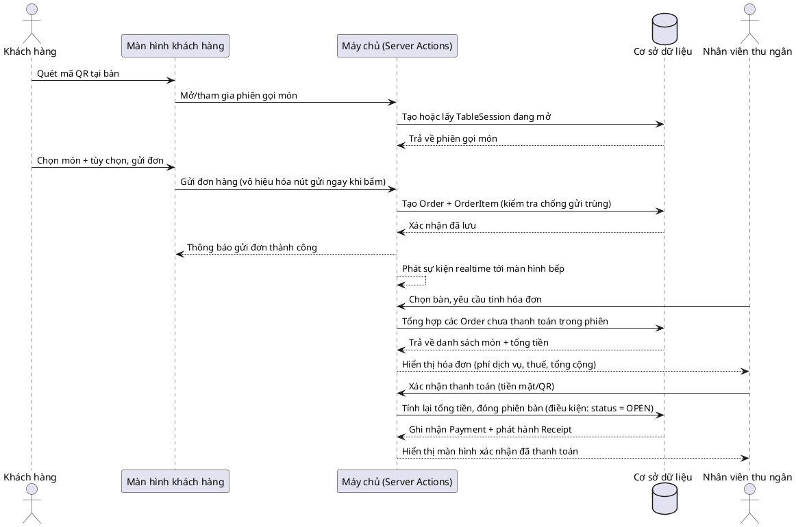

#### 2.10.2. Quy trình cập nhật trạng thái món tại bếp (KDS)

**Hình 15. Biểu đồ tuần tự quy trình cập nhật trạng thái món tại bếp**

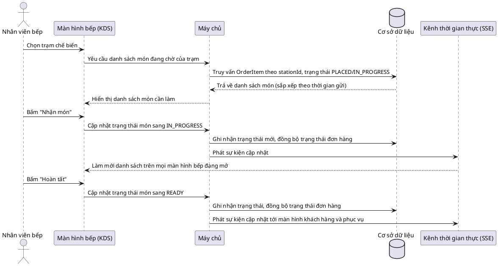

#### 2.10.3. Quy trình mở bàn và tham gia phiên gọi món

**Hình 16. Biểu đồ tuần tự quy trình mở bàn qua mã QR**

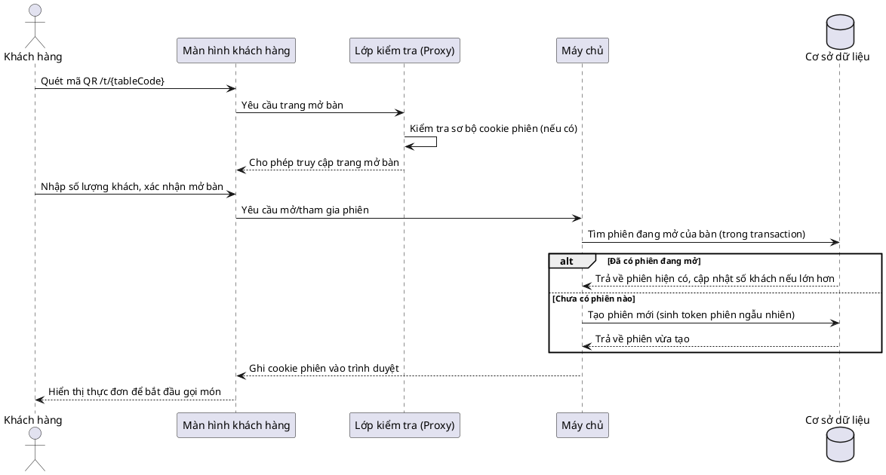

#### 2.10.4. Quy trình xem báo cáo doanh thu

**Hình 17. Biểu đồ tuần tự quy trình xem báo cáo doanh thu**

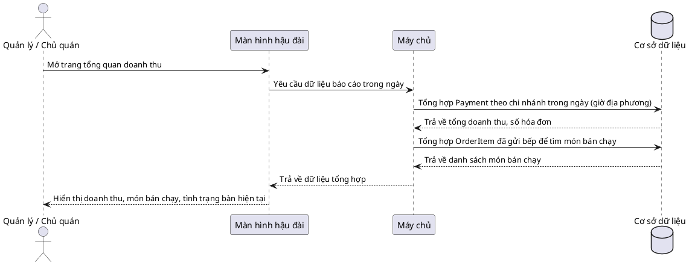

#### 2.10.5. Quy trình quản lý thực đơn

**Hình 18. Biểu đồ tuần tự quy trình thêm/sửa món ăn**

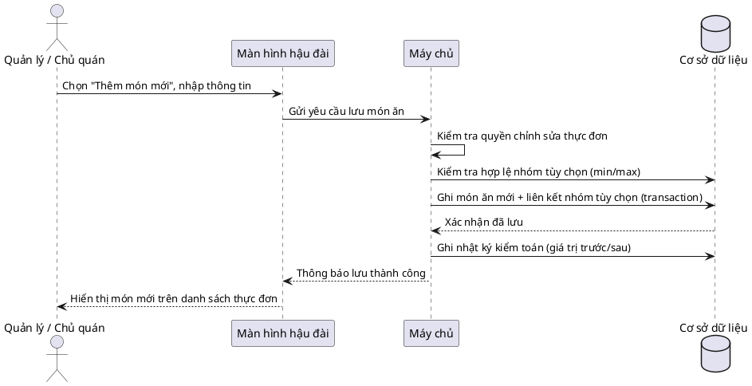

#### 2.10.6. Quy trình quản lý nhân viên

**Hình 19. Biểu đồ tuần tự quy trình đặt lại mã PIN nhân viên**

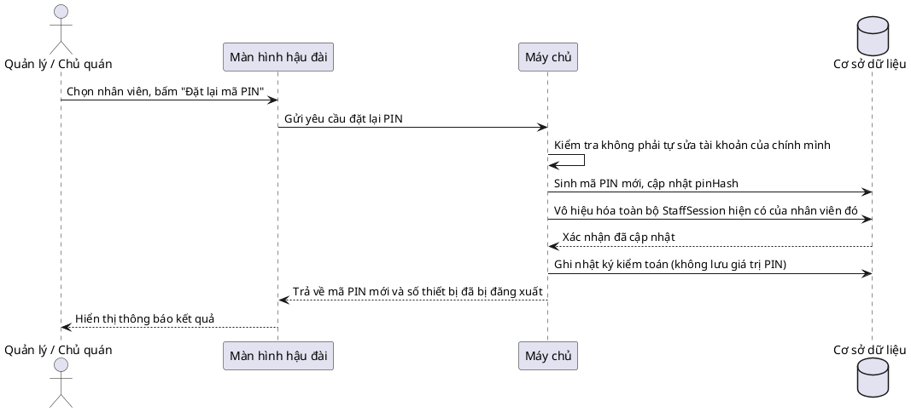

#### 2.10.7. Quy trình chuyển bàn / gộp bàn

**Hình 20. Biểu đồ tuần tự quy trình chuyển bàn và gộp bàn**

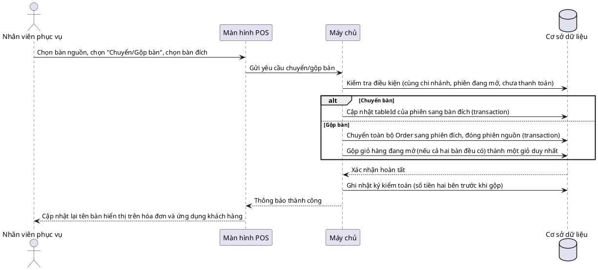

#### 2.10.8. Quy trình đăng nhập bằng mã PIN

**Hình 21. Biểu đồ tuần tự quy trình đăng nhập bằng mã PIN**

```plantuml
@startuml
actor "Nhân viên" as NV
participant "Màn hình đăng nhập" as Login
participant "Máy chủ" as SV
participant "Bộ đếm đăng nhập sai" as Throttle
database "Cơ sở dữ liệu" as DB

NV -> Login: Nhập mã số nhân viên và mã PIN
Login -> SV: Gửi yêu cầu đăng nhập
SV -> Throttle: Kiểm tra số lần nhập sai gần đây
alt Đang bị khóa tạm thời
    Throttle --> SV: Từ chối, còn khóa N phút
    SV --> Login: Thông báo tài khoản tạm khóa
else Chưa bị khóa
    SV -> DB: Tìm nhân viên theo mã số, so khớp mã PIN
    alt PIN đúng
        DB --> SV: Xác thực thành công
        SV -> DB: Tạo StaffSession mới, ghi log staff.login
        SV --> Login: Ghi cookie phiên, chuyển vào màn hình tương ứng vai trò
    else PIN sai
        SV -> Throttle: Ghi nhận một lần nhập sai
        SV -> DB: Ghi log staff.login_failed
        SV --> Login: Thông báo "Sai mã nhân viên hoặc PIN" (không tiết lộ mã nào đúng/sai)
    end
end
@enduml
```
